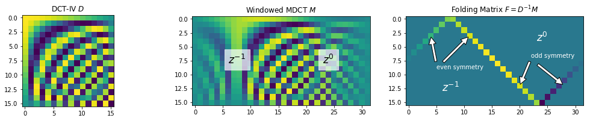

# Experimenting with Lapped Transforms

A Jupyter Notebook for experimenting with lapped transforms.



Click the following links to open the notebooks in Jupyter nbviewer (some math is broken when you open these files directly on GitHub):

 1. [Analysing Lapped Transforms](https://nbviewer.jupyter.org/github/audiolabs/lapped-transforms/blob/master/1%20Analysing%20Lapped%20Transforms.ipynb)
 1. [Transforming Lapped Signal Vectors](https://nbviewer.jupyter.org/github/audiolabs/lapped-transforms/blob/master/2%20Transforming%20Signal%20Vectors.ipynb)

Motivation and Theory, see

> Werner, Nils and Edler, Bernd, **"[Experimenting with Lapped Transforms in Numerical Computation Libraries using Polyphase Matrices and Strided Memory Views](http://www.aes.org/e-lib/browse.cfm?elib=20381)"**. Audio Engineering Society Convention 146, 2019

## Installation

```
git clone https://github.com/audiolabs/lapped-transforms.git
cd lapped-transforms
uv run jupyter notebook
```
